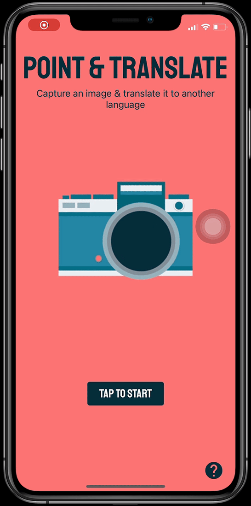

# Point & Translate

## Overview

With Point and Translate, you can use your camera to scan text in a foreign language, and have it translated to another language of choice!

## Technologies
NodeJS, React-Native, Expo, Redux, Google Cloud Vision API, Google Cloud Translation API, Firebase Functions

## Development Mode Setup & Installation
```

// Install all node.js dependencies:
npm install

// Start the app on ExpoGo:
expo start
// Scan the QR code on your phone, then open up the Expo Go app to give Point and Translate a whirl!


```

## Preview:

Home-screen:


Tap to start:


Language Selection:


Translation:


## Dev Team Group Members
Abigail Stauffer
Frances Goodwin
Svetlana Leonova
Jenny Zeng
